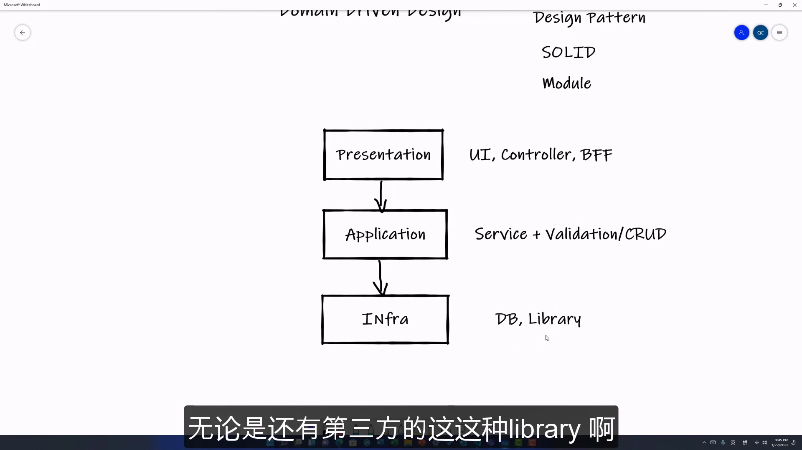

# 01.传统的三层架构

> 参考: <https://youtu.be/Bl39p7SfuJk?list=PLXhG4uwtrC5ixy14ffeL6U9Y5vVUKvRKM>

DDD 是对封装模块化的一套体系思想. 我们可能平时就在利用这些理论. 这个理论就能够很好的把这些良好的设计规律给总结出来.

## 模块化

我们目前大部分的项目是基于一个三层的架构. 他们基本可以被概况为 `Presentation` (展示层), `Application` (应用层), `Infrastructure` (架构层)

### Presentation 展示层

其包括了我们平时的前端界面, Controller, BFF(back end for front end).

> [!TIP]
>
> BFF 意思: 虽然我们的代码是在后端, 但是他起的是完全和前端进行交互对接的作用.
> 所以, 这些一般都是算在 Presentation 这一层里面

### Application 应用层

这一层就是我们传统意义上的各种 `services` (服务) + Validation(验证)/CRUD
也就是一些与数据库的交互和一些存储与读写的逻辑.

### Infrastructure 架构层

这一层就是我们使用到的数据库 DB, 第三方 Library 等等

> [!NOTE]
>
> 可以看到以上的三层的架构的关系, 它是一个很明显的**自上而下**的依赖关系

> [!TIP]
>
> 一般这些 Presentation(前端 和 Controller) 会通过各种各样的 Service to Service 的这种 request 访问到我们的 Application. 而 Application 会执行我们的**业务逻辑**以及与数据库的一个交互, 把结果返回给 Presentation 层
>
> 同理, Application 层也会对 Infrastructure 层有一个强依赖关系. 其会利用如 DAO(data access object) 去进行数据库的读取与存储
> 那么 Application 也相应的对这些 database 和 Library 有一种**强依赖**关系

可以看出, 这样的项目结构它其实是有一定问题存在的.

## 三层架构的问题

1. **首先, Application 层容易过于庞大且臃肿.** 这样就会容易出现**业务逻辑不够清晰**的问题. 这样的话, 对于一个项目的维护是很困难的. *无论是新加入的工程师, 还是工程师想基于现有的功能, 添加一些新的功能.* 他们都很难看清晰业务逻辑是怎么样的. 因为 Application 层太大, 如果没有很好的进行**模块化**, 所有的业务逻辑都堆在一起, 那么这时候想要维护是很困难的.
2. **其次, 对 Infrastructure 的依赖性过高.** 如果我们的这个 Infrastructure 想要进行一些技术层面的升级就会非常的困难. 如 database 的升级: 我们有一天想要换一种更好的 database, 或者是各种第三方的轮子. Application 与 Infrastructure 的**强依赖**关系, 就会对你的业务造成一种阻碍作用. 很多项目可能就会因为这一种原因而放弃了他们的升级计划.
3. 当项目变得过于庞大, 那么采用最新的这种技术架构, 如微服务就会变得非常的困难. 微服务的一大思路, 就是对一个庞大的应用程序进行分解, 分解之后, 各个微服务能够独立的运行和升级管理. 这种新型的微服务的架构, 能够帮助我们进行更快的项目迭代以及更小的**影响域**来更新一些服务. 比如我们可以只更新一个服务而对其他服务没有影响等等.

> [!NOTE]
>
> 可以看出, 传统的三层架构对于我们逐渐演进项目造成很大的问题.
