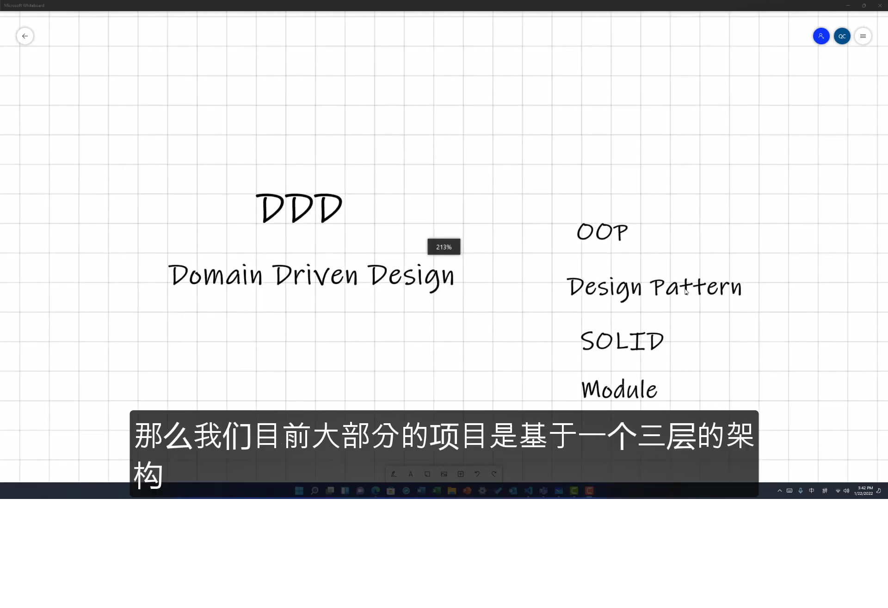

# 初识

> 参考: <https://youtu.be/Bl39p7SfuJk?list=PLXhG4uwtrC5ixy14ffeL6U9Y5vVUKvRKM>

DDD 是对封装模块化的一套体系思想. 我们可能平时就在利用这些理论. 这个理论就能够很好的把这些良好的设计规律给总结出来.

## 模块化

我们目前大部分的项目是基于一个三层的架构. 他们基本可以被概况为 `Presentation`(展示层), `Application`(应用层)

### Presentation 展示层

其包括了我们平时的前端界面, Controller, BFF(back end for front end).

> [!TIP]
>
> BFF 意思: 虽然我们的代码是在后端, 但是他起的是完全和前端进行交互对接的作用.
> 所以, 这些一般都是算在 Presentation 这一层里面

### Application 应用层

这一层就是我们传统意义上的各种 services.
