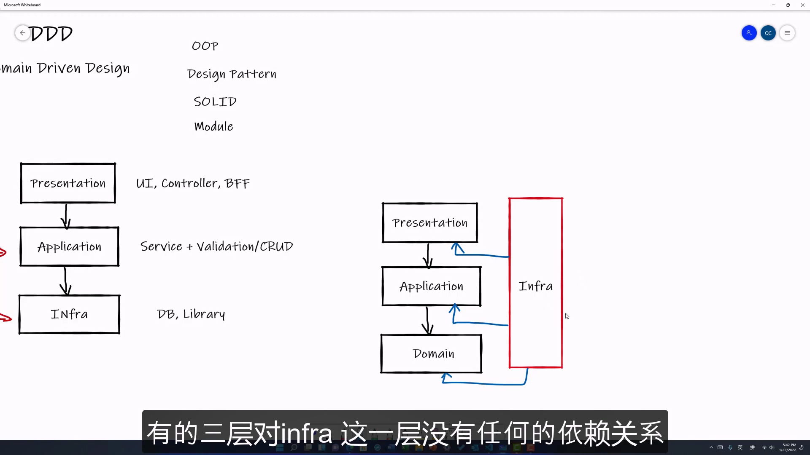

# 02.DDD的提出

从 [01.传统的三层架构](./01.传统的三层架构.md) 可以看出, 传统的三层架构对于我们逐渐演进项目造成很大的问题.

而 domain driven design 提出了三层架构需要被更新. 更新过后的的架构可以更加适用于不同的场景.

## DDD的演进

DDD提出, 应该在 `Application` 与 `Infrastructure` 之间加多一层, 命名为 `Domain` 层.

### Domain(领域层)

domain 也就是我们常说的领域层.

为什么需要 Domain 层.
> [!NOTE]
>
> 应用程序的逻辑可以分成**两大类**.
> 一是固定不变的, 常用的逻辑, 这种逻辑应该放在 `domain` 层中. 比如: 一个订单正常下单的业务逻辑, 其核心内容是相似的, 甚至是固定不变的.
>
> Application 层主要是用来负责接入不同的 use case, 即: 负责接入不同的应用场合.

> [!TIP]
>
> 应用场合指的是一些**不同的场合会产生不同的业务逻辑**
>
> 如: 某个网络应用中, 用户从**手机端**接入和从网络端接入, 其业务逻辑可能会产生些许不同.
> 那么这些逻辑就应该放在 Application 层中.
>
> 或者说: 同样一个网站, 如电商网站. 如果是用户(*买方*)登录此网站, 其与店家(*卖方*)登录此网站, 他们的业务逻辑也是不相同的.
> 那么类似这种的, 处理不同逻辑的部分, 也应该放在 Application 层中.

### Infrastructure的演进

在三层架构中, 我们需要面对的就是 Infrastructure 层的复杂的依赖情况. 由于 Infra 层中大部分是的第三方类库, 以及著名的开源轮子, 如消息队列, 缓存等等.
所以, 我们希望我们的程序的所有层尽可能的独立于, 或者说是与 Infra 层**尽可能的解耦**.

也就要求了 Infra 层在整体架构中发生了变化.

如上图:
我们可以看到, Infra 层是依赖于已有的三层.
而已有的三层(Presentation, Application, Domain)没有任何的依赖关系.

如何实现? 答: 其实就是添加一层称为防腐层的隔离.
