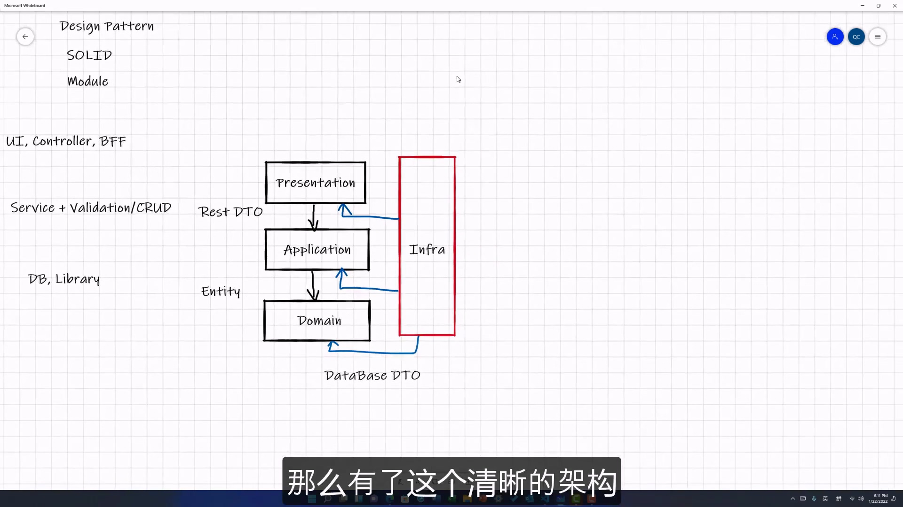

# 03.DDD的传输方式

## Presentation -> Application

DDD中, Presentation 与 Application 之间传输的应该是一种叫 `REST DTO` 的东西.
即: REST API, 或者说 API 接口层, 以及我们平常定义 API 是以 Swagger 方式定义的.

> [!TIP]
>
> DTO, data transfer object. 即: 我们以及用户数据之间的接口数据定义是什么.
> 其常理来说是**不可轻易修改**的.
>
> 每次对这个 DTO 增加, 修改数据都要有很严格的 API 版本的控制策略.

## Application -> Domain

Application 与 Domain 之间传输的是 Entity.

> [!NOTE]
>
> **为什么 Entity 与 REST DTO 不是同样的数据定义?**
>
> 答: 和用户接口的数据定义的是不可以随意修改的, 但是 Domain 的业务逻辑是随时可以变化的.
> 比如这个 Entity, 其可能承载了更多的状态, 或者某一个业务的逻辑部分发生了修改等等.
> *这些原因都有可能导致 Entity 的定义是变化的.*
>
> 所以, 为了让 Entity 与 DTO 这两个数据结构解耦, 最好, 我们**将其定义为两种不同的数据定义**.

## Domain -> Infra (domain 与 数据库)

Domain 与 Infra(数据库) 之间传输的是 database DTO

### database DTO

database DTO也就是我们常常定义的数据库 Schema, 与 REST DTO 同理, 这个 Schema 也同样是不可轻易修改的.

每次的数据库修改都要有 Migration, 我们需要保证 database DTO 相对的稳定.

所以, 当 Domain 做任何的数据库的存储以及读取时, 都要介于 `Entity` 与 `Database DTO` 之间做一次转换.
