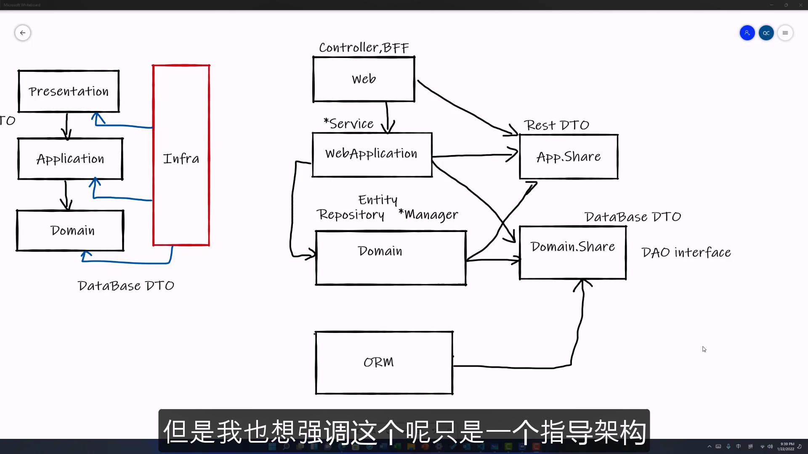

# 项目的模块化

当开始一个软件项目时, 我们最需要是设计好此项目有哪几个 Project.
他们都属于一种什么关系, 他们的依赖关系是如何的.
甚至说他们的命名, 他们需要在哪些文件夹等等.

## 项目结构

根据之前DDD的介绍, 我们可以对项目进行设计, 进行模块划分.

### Web模块

首先是 Presentation 层
我们的 Controller, BFF, UI 等等的一些说法的模块, 我们都应将其放在一个叫 Web 的模块中.

### Web Application 模块

Application 层代表了不同的使用场景, 我们需要根据不同的场景, 创建属于他们的 Application.

这一模块我们暂且将其命名为 WebApplication. 如果有手机的 Application, 各种不同场景的 Application, 那么都应该定义在这个地方.

其主要包括我们所说的各种 Service

Presentation 和 Application 都是基于 REST DTO 进行的一种交互, 这个 DTO 也需要**单独定义**出来.

#### Application Share 模块

> [!TIP]
>
> 参考视频建议: 一般所有的 DTO 定义在 Application 层, 一般所有的 DTO 最后被单独的定义在一个包中.
> 其代表了最低的一种 dependency 的一种单元. 方便所有别的包引用他时不会造成**循环引用**(circular dependency) 的情况发生.

在此处, 我们也将这种包独立出来. 在 ABP 框架中, 命名规则为: "项目名称.Share". 例如 **App.Share**. 这种命名一般是根据团队的命名规则来命名. 有时候也叫做 `Contract` (契约层).

[参考视频](https://youtu.be/Bl39p7SfuJk?list=PLXhG4uwtrC5ixy14ffeL6U9Y5vVUKvRKM)

### Domain 模块

Domain 是 DDD 的核心.

其包含了 `Repository`, `* Manager`, `Entity`.

Domain 层就是命名为相对于的 domain. 如: 订单就称之为 order.

domain 层一般包含的是 domain Service 以及数据仓库.

#### Repository

domain 主要包含的一种是 `Repository`.

> [!NOTE]
>
> Repository 是基于更上层的, 对于 DTO 的一种封装层, 便于我们对所有数据进行访问.

> [!TIP]
>
> 对于复杂的场景, 有的时候我们还需要定义一种叫 Factory, 利用 Factory 来对 Repository 进一步的组装.

我们只需要理解, domain 访问数据/CRUD 都要经过 Repository 即可.

#### * Manager

除了 Repository, 还要定义 domain service.
**命名规则建议: 相对应的 domain + manager, 比如 订单的domain, orderManager**

> [!NOTE]
>
> domain service 一般会被 Share 给 Application 层, 用于直接访问 domain 的某种业务逻辑.
> 比如 WebApplication 需要创建一个订单, 一般是把 domain manager 这一层的实现 dependency injection 依赖注入到 application 层中, 然后调用 manager 的方法来创建订单, 删除订单等等.

#### Entity

Domain 模块包含 **Entity**. 所有的 application 和 domain 之间的数据的 Entity 都要定义在这个部分.

> [!TIP]
>
> Entity 中包含了一部分的业务逻辑, 含有业务逻辑的部分应该被 domain 包含.

#### Domain Share 模块

同理, domain 层也需要有一个 Share Library. 其通常命名为 Domain.Share

> [!NOTE]
>
> Domain.Share 通常会封装比较多的内容. 此模块也会是我们整个应用程序中最重要的数据定义都定义在此模块中.
>
> 1. **database DTO**. 基于数据库的 Schema, 我们需要建立对应的 DTO, 同样放在 Domain.Share 中.
> 2. **DAO Interface**. DAO (database access object) 是用来访问数据库的接口, **应该在 Domain.Share 中定义好这些接口, 然后由 Infra 层进行其实现**.

> [!TIP]
>
> domain 层会依赖于 domain.share, 所以 Repository 会直接利用定义好的 DAO Interface 来进行底层数据库的访问.
>
> 通过这种方式, Repository 不知道底层 DAO 具体的实现方式. 从而达到了 domain 和 Infrastructure database, 即: 数据访问相关的操作的一种解耦.

### Infrastructure 模块

一般在这里会使用了某某 ORM 等第三方的类库.

其与 Domain.Share 是**直接依赖**的关系. 他需要去直接实现 DAO Interface.

当我们有更多的第三方的类库, 也是需要去实现他们的模块. 所有的第三方的类库也需要去直接引用 domain.share 中对其 Interface 的实现. 如此 domain 层并不知道具体的实现方案, 这就是之前提过的**防腐层**.

最后做到, 只有 Infrastructure (ORM, 第三方类库) 对 domain 层有一种依赖. 而 domain 对这些模块并不知情. 没有直接的依赖关系.
